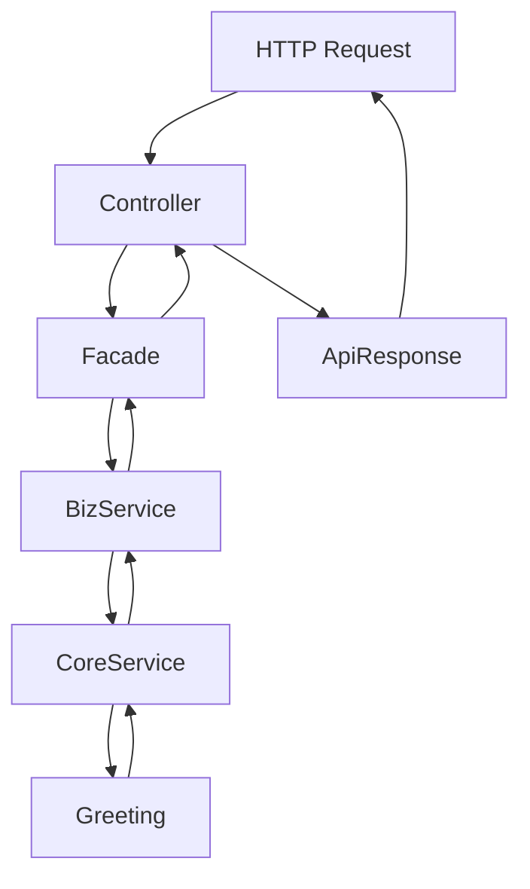

# Data Model: Hello World REST API

**Date**: 2026-04-26
**Feature**: Hello World REST API
**Status**: Complete

## Entities

### 1. ApiResponse (Common Utility)

**Purpose**: Standard response wrapper for all API endpoints

**Attributes**:
- `message` (String, required): The response message content
- `status` (String, optional): Response status (success/error/warning)
- `timestamp` (LocalDateTime, optional): Response generation timestamp
- `version` (String, optional): API version information

**Validation Rules**:
- `message` must not be null or empty
- `status` must be one of: success, error, warning
- `version` must follow semantic versioning format (x.y.z)

**State Transitions**: N/A (immutable DTO)

**Relationships**: Used by all controller endpoints

### 2. HealthResponse (extends ApiResponse)

**Purpose**: Specialized response for health check endpoint

**Additional Attributes**:
- `serviceStatus` (String, required): Overall service health status
- `dependencies` (Map<String, String>, optional): Status of external dependencies
- `uptime` (Duration, optional): Service uptime duration

**Validation Rules**:
- `serviceStatus` must be one of: healthy, degraded, unhealthy
- Each dependency status must be one of: up, down, unknown

### 3. RequestParameters

**Purpose**: Container for API request parameters

**Attributes**:
- `name` (String, optional): Name parameter for personalized greeting
- `format` (String, optional): Response format (currently only JSON supported)

**Validation Rules**:
- `name` must not contain harmful characters or scripts
- `name` length limited to 100 characters maximum
- `format` must be one of: json (currently only option)

## Domain Objects

### Greeting

**Purpose**: Represents a greeting message to be returned by the API

**Attributes**:
- `content` (String, required): The greeting message text
- `recipient` (String, optional): The name of the person being greeted
- `timestamp` (Instant, required): When the greeting was generated

**Business Rules**:
- If no recipient specified, use default "World"
- Greeting must be culturally appropriate and professional
- Timestamp must be current time (±1 second)

## Data Flow

## Validation Rules

### Input Validation

1. **Name Parameter**:
   - Maximum length: 100 characters
   - Allowed characters: letters, numbers, spaces, basic punctuation
   - Forbidden: SQL injection patterns, script tags, control characters

2. **HTTP Methods**:
   - GET: Allowed for all endpoints
   - POST/PUT/DELETE: Return 405 Method Not Allowed

3. **Content-Type**:
   - Accept: application/json
   - Return: application/json

### Output Validation

1. **Response Format**:
   - Must be valid JSON
   - Must include Content-Type: application/json header
   - Must include proper HTTP status code

2. **Error Responses**:
   - Must include error message
   - Must include error code
   - Must include timestamp

## State Management

### Stateless Design

The Hello World API is completely stateless:
- No session management required
- No user authentication/authorization
- Each request is independent
- No server-side state maintained between requests

### Thread Safety

All components must be thread-safe:
- Service classes should be stateless or use thread-local storage
- No shared mutable state
- Immutable DTOs for request/response objects

## Persistence

**Decision**: No persistence layer required

**Rationale**:
- All responses are generated programmatically
- No data needs to be stored or retrieved
- No user accounts or preferences to maintain
- Health status is computed, not stored

**Future Considerations**:
- If persistence needed later, would add:
  - JPA entities
  - Repository interfaces
  - Database migration scripts
  - Transaction management

## API Contracts

See `/contracts/` directory for detailed API specifications.