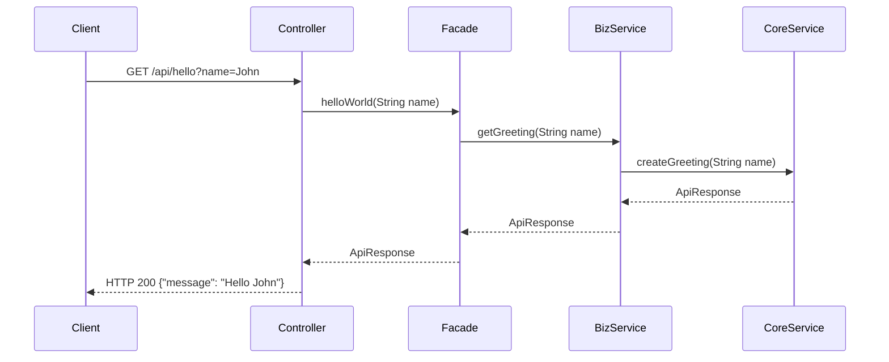
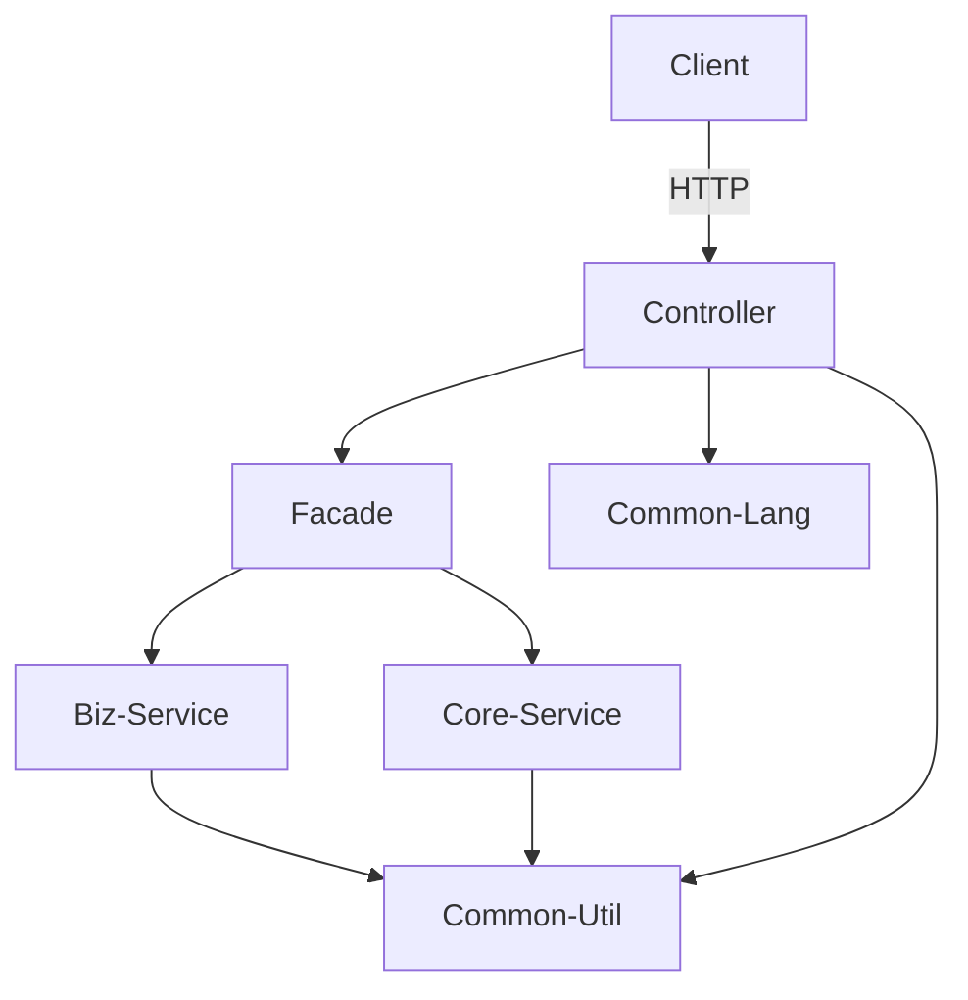
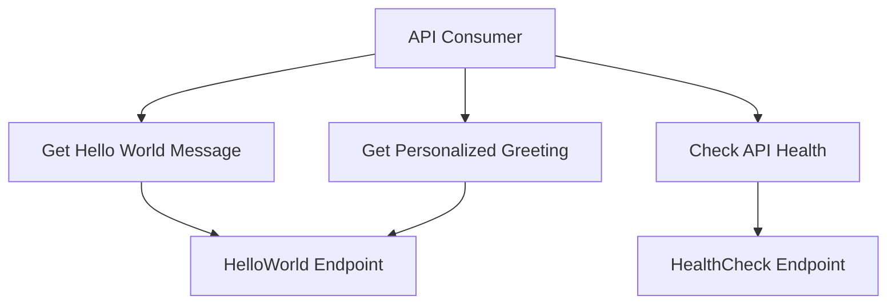

# Implementation Plan: Hello World REST API

**Branch**: `002-hello-world-api` | **Date**: 2026-04-26 | **Spec**: [spec.md](spec.md)
**Input**: Feature specification from `/specs/002-hello-world-api/spec.md`

**Note**: This template is filled in by the `/speckit.plan` command. See `.specify/templates/plan-template.md` for the execution workflow.

## Summary

This plan implements a simple REST API with three endpoints: a basic hello world endpoint, a personalized greeting endpoint with name parameter, and a health check endpoint. The API will be built using Java 25 with Spring Boot following the project's established backend architecture (facade, biz-service, core-service, repository layers). The implementation will focus on clean code with Javadoc documentation and proper REST API design principles.

## Technical Context

<!--
  ACTION REQUIRED: Replace the content in this section with the technical details
  for the project. The structure here is presented in advisory capacity to guide
  the iteration process.
-->

**Language/Version**: Java 25  
**Primary Dependencies**: Spring Boot 3.x, Spring Web MVC, Jackson (JSON processing)  
**Storage**: N/A (No database required for this simple API)  
**Testing**: JUnit 5, Mockito, Spring Boot Test  
**Target Platform**: Linux/Windows servers, Java 25 runtime environment  
**Project Type**: web-service (REST API backend)  
**Performance Goals**: <500ms response time for 99.9% of requests, handle 100+ concurrent connections  
**Constraints**: <100MB memory footprint, <200ms p95 latency, JSON responses only  
**Scale/Scope**: 3 REST endpoints, minimal business logic, development environment focus

## Constitution Check

*GATE: Must pass before Phase 0 research. Re-check after Phase 1 design.*

- ✅ Clean code and Javadoc for all methods. (Will implement with proper Java documentation)
- ✅ Separation of responsibilities between frontend and backend using REST API. (API-only implementation, no frontend)
- ✅ Branch management: No direct pushes to main or master; use feature branches and pull requests. (Currently on feature branch 002-hello-world-api)
- ✅ Technology stack: Java 25, Spring Boot, Thymeleaf, PostgreSQL. (Using Java 25 + Spring Boot, Thymeleaf and PostgreSQL not needed for this simple API)
- ✅ Backend structure: facade, biz-service, core-service, repository, integration, common-util, common-lang. (Will implement modular structure despite simplicity)

## Project Structure

### Documentation (this feature)

```text
specs/[###-feature]/
├── plan.md              # This file (/speckit.plan command output)
├── research.md          # Phase 0 output (/speckit.plan command)
├── data-model.md        # Phase 1 output (/speckit.plan command)
├── quickstart.md        # Phase 1 output (/speckit.plan command)
├── contracts/           # Phase 1 output (/speckit.plan command)
└── tasks.md             # Phase 2 output (/speckit.tasks command - NOT created by /speckit.plan)
```

### Source Code (repository root)
<!--
  ACTION REQUIRED: Replace the placeholder tree below with the concrete layout
  for this feature. Delete unused options and expand the chosen structure with
  real paths (e.g., apps/admin, packages/something). The delivered plan must
  not include Option labels.
-->

```text
backend/
├── src/
│   ├── main/
│   │   ├── java/com/colossus/helloworld/
│   │   │   ├── facade/
│   │   │   │   ├── HelloWorldFacade.java
│   │   │   │   └── HealthCheckFacade.java
│   │   │   ├── bizservice/
│   │   │   │   ├── HelloWorldBizService.java
│   │   │   │   └── HealthCheckBizService.java
│   │   │   ├── coreservice/
│   │   │   │   ├── HelloWorldCoreService.java
│   │   │   │   └── HealthCheckCoreService.java
│   │   │   ├── repository/
│   │   │   │   └── (empty - no DB needed)
│   │   │   ├── integration/
│   │   │   │   └── (empty - no external integrations)
│   │   │   ├── commonutil/
│   │   │   │   ├── ApiResponse.java
│   │   │   │   └── Constants.java
│   │   │   ├── commonlang/
│   │   │   │   └── (enums and POJOs if needed)
│   │   │   └── controller/
│   │   │       ├── HelloWorldController.java
│   │   │       └── HealthCheckController.java
│   │   └── resources/
│   │       └── application.properties
│   └── test/
│       ├── java/com/colossus/helloworld/
│       │   ├── facade/
│       │   ├── bizservice/
│       │   ├── coreservice/
│       │   └── controller/
│       └── resources/
└── pom.xml
```

**Structure Decision**: Using the standard backend structure as defined in the constitution with all required modules (facade, biz-service, core-service, repository, integration, common-util, common-lang). Even though this is a simple API, maintaining the full structure ensures consistency with the project architecture and makes it easier to extend in the future.

## Diagrams

### Sequence Diagram


### Component Diagram


### Use Case Diagram


## Complexity Tracking

> **Fill ONLY if Constitution Check has violations that must be justified**

| Violation | Why Needed | Simpler Alternative Rejected Because |
|-----------|------------|-------------------------------------|
| [e.g., 4th project] | [current need] | [why 3 projects insufficient] |
| [e.g., Repository pattern] | [specific problem] | [why direct DB access insufficient] |
