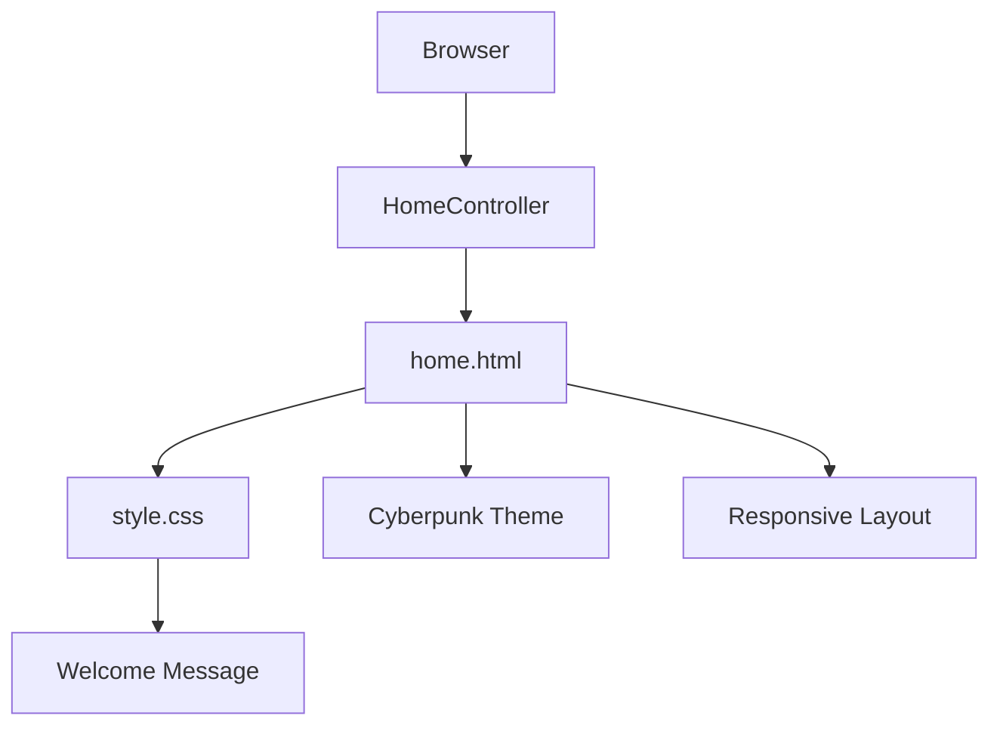
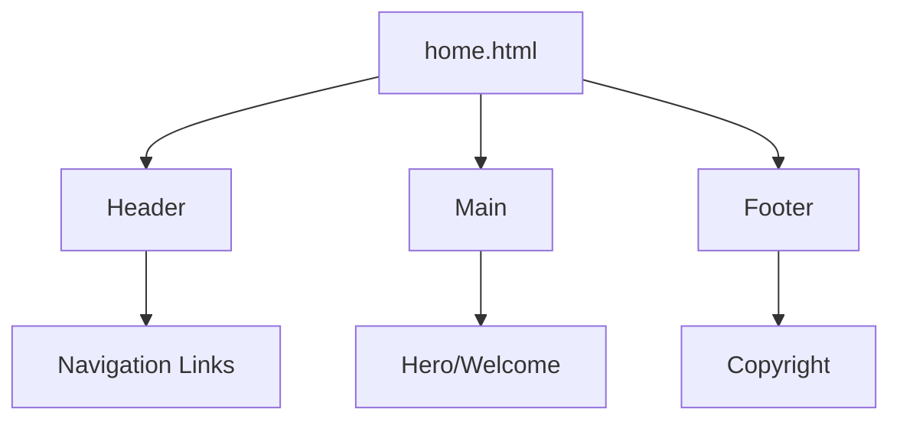

# Implementation Plan: Home Page in HTML

**Branch**: `[003-home-page-html]` | **Date**: 2026-04-26 | **Spec**: specs/003-home-page-html/spec.md
**Input**: Feature specification from `/specs/003-home-page-html/spec.md`

**Note**: This template is filled in by the `/speckit.plan` command. See `.specify/templates/plan-template.md` for the execution workflow.

## Summary

Create a static HTML home page with a dark, dynamic modern cyberpunk theme. The page displays a welcome message ("What you call impossible is merely unattempted; what you call power is merely insufficient.") and includes navigation, footer, and responsive design.

## Technical Context

**Language/Version**: HTML5, CSS3, JavaScript (ES6+)  
**Primary Dependencies**: None - pure vanilla HTML/CSS/JS  
**Storage**: N/A - static file  
**Testing**: Browser manual testing, HTML5 validation  
**Target Platform**: Modern web browsers (Chrome, Firefox, Safari, Edge, Opera)  
**Project Type**: Static website (single HTML file)  
**Performance Goals**: Load within 3 seconds  
**Constraints**: Progressive enhancement, WCAG 2.1 AA contrast ratio, responsive 320px-1920px  
**Scale/Scope**: Single-page website

## Constitution Check

*GATE: Must pass before Phase 0 research. Re-check after Phase 1 design.*

**Note**: Constitution rules apply to Java/Spring Boot backend projects. This is a static HTML page, so backend-specific requirements (Java, Spring Boot, PostgreSQL, REST API, facade/biz-service/core-service structure) do not apply. Frontend best practices will be followed instead.

- Clean code with semantic HTML and well-organized CSS.
- Branch management: No direct pushes to main or master; use feature branches and pull requests.
- Progressive enhancement for accessibility.
- WCAG 2.1 AA accessibility compliance.
- Responsive design for 320px-1920px screen widths.

## Project Structure

### Documentation (this feature)

```text
specs/003-home-page-html/
├── plan.md              # This file (/speckit.plan command output)
├── research.md          # Phase 0 output (/speckit.plan command)
├── data-model.md        # Phase 1 output (/speckit.plan command)
├── quickstart.md        # Phase 1 output (/speckit.plan command)
├── contracts/           # Phase 1 output (/speckit.plan command)
└── tasks.md             # Phase 2 output (/speckit.tasks command - NOT created by /speckit.plan)
```

### Source Code (colossus submodule)

```text
# Thymeleaf + Static Resources (colossus)
colossus/src/main/resources/
├── templates/
│   └── home.html        # Thymeleaf template
└── static/
    └── css/
        └── style.css  # Cyberpunk theme CSS

# No backend required - static page
```

## Diagrams

### Component Diagram


### Structure Diagram


## Complexity Tracking

> **Fill ONLY if Constitution Check has violations that must be justified**

| Violation | Why Needed | Simpler Alternative Rejected Because |
|-----------|------------|-------------------------------------|
| [e.g., 4th project] | [current need] | [why 3 projects insufficient] |
| [e.g., Repository pattern] | [specific problem] | [why direct DB access insufficient] |
