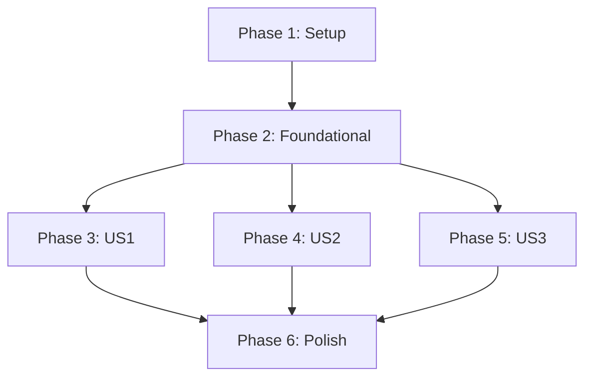

# Tasks: Home Page in HTML

**Feature**: Home Page in HTML
**Branch**: 003-home-page-html
**Spec**: specs/003-home-page-html/spec.md
**Plan**: specs/003-home-page-html/plan.md

## Phase 1: Setup

- [ ] T001 Create project directory structure (index.html, assets/css/, assets/js/)
- [ ] T002 Create base HTML document structure in index.html
- [ ] T003 Create base CSS file in assets/css/style.css

## Phase 2: Foundational

- [ ] T004 [P] Implement HTML5 semantic structure (header, nav, main, footer)
- [ ] T005 [P] Set up CSS custom properties for cyberpunk theme
- [ ] T006 Configure responsive viewport, base typography (system fonts), and fallback stack

## Phase 3: User Story 1 - View Home Page (P1)

**Goal**: Display welcome message and navigation on home page

**Independent Test**: Open index.html in browser, verify welcome message and navigation render correctly

- [ ] T007 [P] [US1] Create header with navigation in index.html
- [ ] T008 [P] [US1] Create main content section with welcome message
- [ ] T009 [P] [US1] Implement cyberpunk theme styling in assets/css/style.css
- [ ] T010 [US1] Create footer with copyright in index.html

## Phase 4: User Story 2 - Navigate from Home Page (P2)

**Goal**: Users can click navigation links to access different sections

**Independent Test**: Click navigation link and verify it leads to destination

- [ ] T011 [P] [US2] Add navigation link href attributes
- [ ] T012 [P] [US2] Implement hover effects for navigation links in CSS

## Phase 5: User Story 3 - Access on Different Devices (P3)

**Goal**: Responsive design for mobile, tablet, desktop

**Independent Test**: Resize browser, verify layout adapts to 320px-1920px

- [ ] T013 [P] [US3] Implement responsive grid/flex layout in CSS
- [ ] T014 [P] [US3] Add media queries for mobile (320px-768px)
- [ ] T015 [P] [US3] Add media queries for tablet (768px-1024px)
- [ ] T016 [P] [US3] Verify desktop layout (1024px-1920px)

## Phase 6: Polish & Cross-Cutting

**Goal**: Edge cases and final polish

- [ ] T017 [P] Implement loading indicator for assets
- [ ] T018 [P] Add fallback fonts for font loading failure
- [ ] T019 Verify WCAG 2.1 AA contrast ratio
- [ ] T020 Verify progressive enhancement (no JS required for core functionality)
- [ ] T021 Test in multiple browsers (Chrome, Firefox, Safari, Edge, Opera)
- [ ] T022 HTML5 validation

## Dependencies

## Parallel Execution

**Within Phase 3 (US1)**:
- T007, T008, T009 can run in parallel (different files/components)

**Within Phase 4 (US2)**:
- T011, T012 can run in parallel

**Within Phase 5 (US3)**:
- T013, T014, T015, T016 can run in parallel

**Within Phase 6 (Polish)**:
- T017, T018 can run in parallel

## Implementation Strategy

**MVP Scope**: User Story 1 (Phase 3)
- index.html with welcome message
- Navigation links
- Basic cyberpunk theme
- Footer

**Incremental Delivery**:
1. Complete Phase 1-3 → Working MVP
2. Add Phase 4 → Navigation working
3. Add Phase 5 → Responsive design
4. Add Phase 6 → Polish and edge cases

## Summary

| Metric | Value |
|--------|-------|
| Total Tasks | 22 |
| User Story 1 | 4 tasks |
| User Story 2 | 2 tasks |
| User Story 3 | 4 tasks |
| Setup/Foundational | 6 tasks |
| Polish | 6 tasks |
| Parallelizable | 13 tasks |

**MVP**: 10 tasks (Phase 1-3)