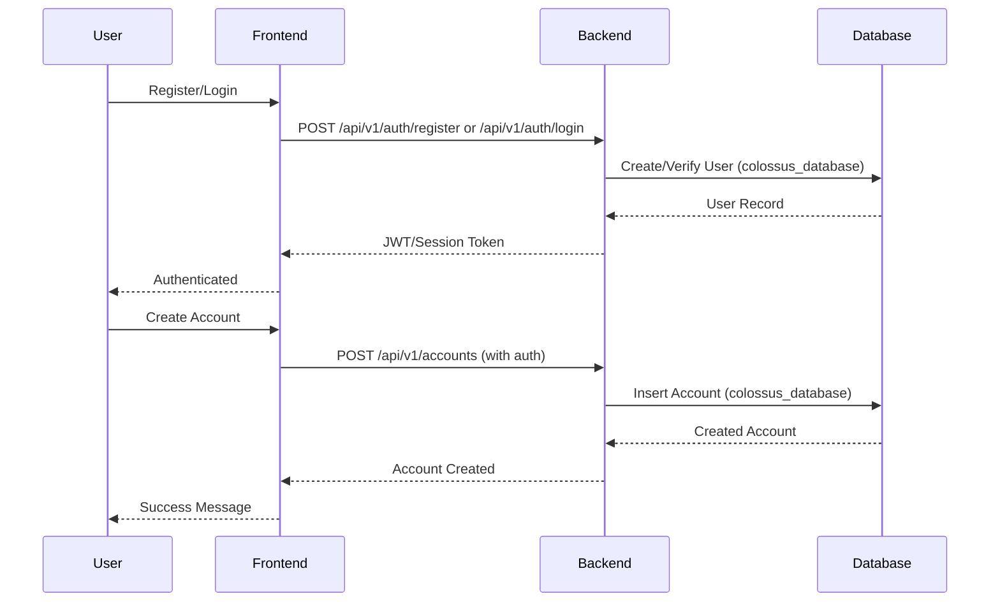
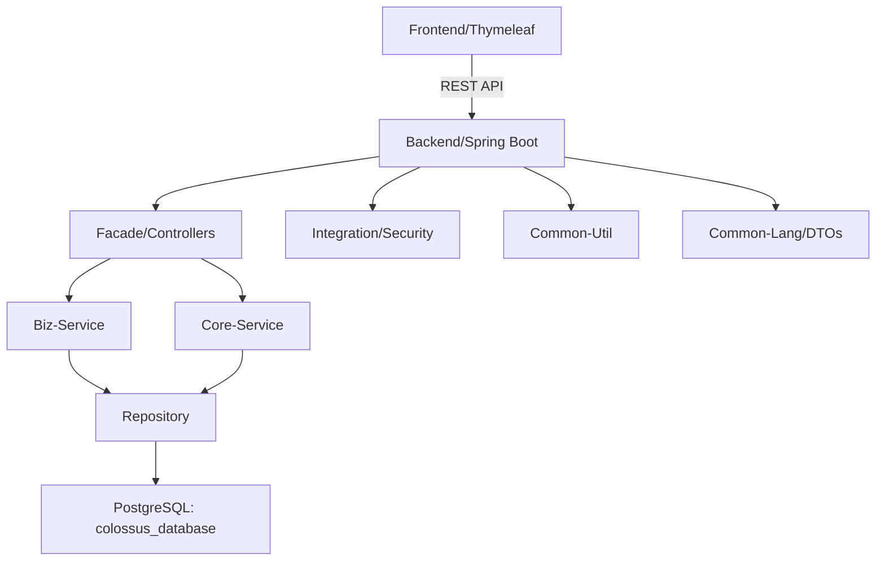
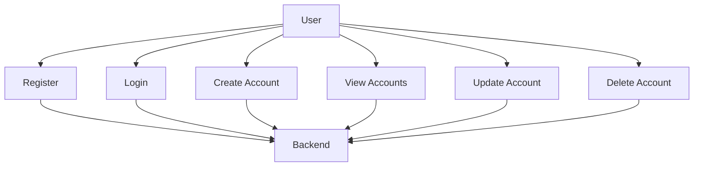

# Implementation Plan: Budget Account Management

**Branch**: `[004-budget-account]` | **Date**: April 27, 2026 | **Spec**: [spec.md](./spec.md)

**Input**: Feature specification from `/specs/004-budget-account/spec.md`

## Summary

The Budget Account Management feature enables users to register, login, and manage their budget accounts. Users can create, view, update, and delete budget accounts with properties including accountName, accountNo, accountType (cash/debit), accountDescription, and accountCurrency. The frontend (Thymeleaf) communicates with the backend (Spring Boot) via REST API endpoints.

## Technical Context

| Attribute | Value |
|-----------|-------|
| **Language/Version** | Java 25 |
| **Primary Dependencies** | Spring Boot, Thymeleaf, Spring Security, Spring Data JPA |
| **Storage** | PostgreSQL - Single database: `colossus_database` (all tables as master data) |
| **Testing** | JUnit, Spring Boot Test |
| **Target Platform** | Web (desktop browsers) |
| **Project Type** | Web Service (Spring Boot) with Thymeleaf Frontend |
| **Performance Goals** | Response time < 3 seconds for page loads, < 2 minutes for account creation |
| **Constraints** | Mobile support out of scope for v1 |
| **Scale/Scope** | Single user per account, moderate scale |

## Constitution Check

*GATE: Must pass before Phase 0 research. Re-check after Phase 1 design.*

- [x] Clean code and Javadoc for all methods.
- [x] Separation of responsibilities between frontend and backend using REST API.
- [x] Branch management: No direct pushes to main or master; use feature branches and pull requests.
- [x] Submodule branch management: Submodule branch must match parent module branch name; checkout or create branch before editing.
- [x] Technology stack: Java 25, Spring Boot, Thymeleaf, PostgreSQL (single database: colossus_database).
- [x] Backend structure: facade, biz-service, core-service, repository, integration, common-util, common-lang.

## Project Structure

### Documentation (this feature)

```text
specs/004-budget-account/
├── plan.md              # This file
├── research.md          # Phase 0 output
├── data-model.md        # Phase 1 output
├── quickstart.md        # Phase 1 output
├── contracts/           # Phase 1 output
└── tasks.md             # Phase 2 output (/speckit.tasks command)
```

### Source Code (submodule - colossus)

According to the constitution, all implementation must be in the `colossus` submodule under `colossus/src/main/java/id/colossus/`.

```text
colossus/
├── src/main/java/id/colossus/
│   ├── [backend-structure]/
│   │   ├── facade/          # REST controllers
│   │   ├── biz-service/     # Business logic
│   │   ├── core-service/    # Core services
│   │   ├── repository/     # Data access
│   │   ├── integration/    # External integrations
│   │   ├── common-util/    # Utilities
│   │   └── common-lang/    # DTOs, enums, constants
│   └── budget/
│       └── account/         # Budget account feature
├── src/main/resources/
│   ├── templates/           # Thymeleaf templates
│   ├── static/js/          # JavaScript files
│   ├── db/ddl/             # Database migrations
│   └── db/dml/             # Seed data
└── src/test/               # Unit and integration tests
```

**Structure Decision**: Web application with Spring Boot backend and Thymeleaf frontend. The backend follows the modular structure (facade → biz-service → core-service → repository). All code resides in the `colossus` submodule.

## Diagrams

### Sequence Diagram


### Component Diagram


### Use Case Diagram


## Phase 0: Outline & Research

No additional research needed. All technical context is defined by the constitution:
- Language: Java 25 with Spring Boot
- Frontend: Thymeleaf
- Database: PostgreSQL with single database `colossus_database`
- API: REST with proper status codes
- Authentication: Session-based with username/password

The feature requirements are clear and align with existing patterns.

## Phase 1: Design & Contracts

### Research Summary

All unknowns resolved from specification:
- Authentication: Basic session-based (username/password) - no external auth needed
- API Style: RESTful with standard HTTP methods
- Tech Stack: Already defined by constitution, including single database constraint

### Data Model

See `data-model.md` for entity definitions.

### API Contracts

See `contracts/` directory for REST API specifications.

### Quick Start

See `quickstart.md` for development setup instructions.

## Complexity Tracking

No violations to track. All requirements align with the constitution.

---

**Generated**: April 27, 2026
**Status**: Planning Complete
**Next Step**: Run `/speckit.tasks` to generate implementation tasks